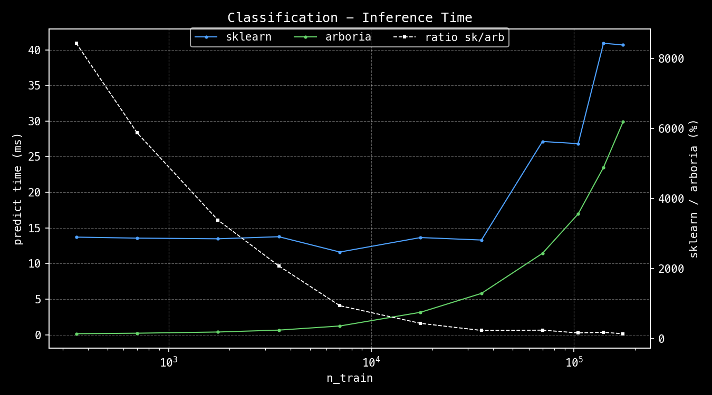
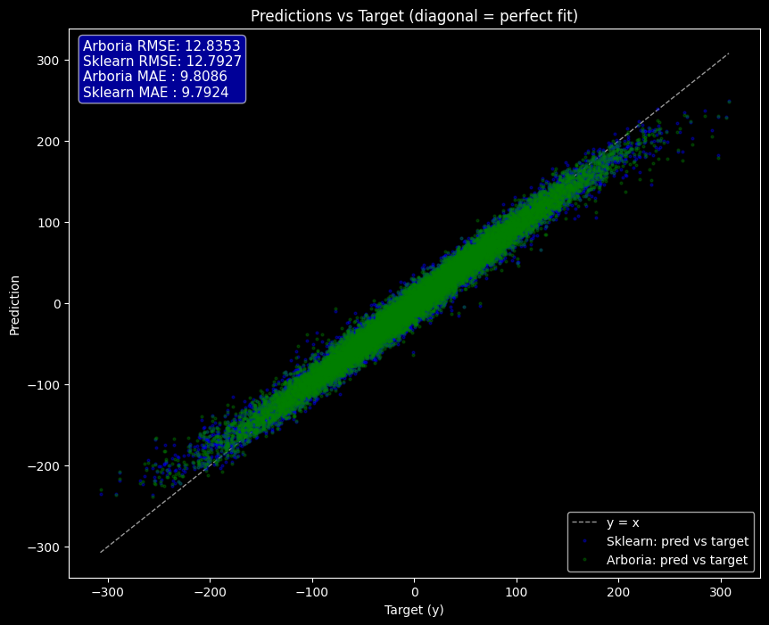
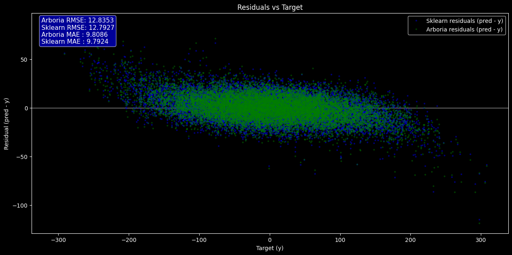
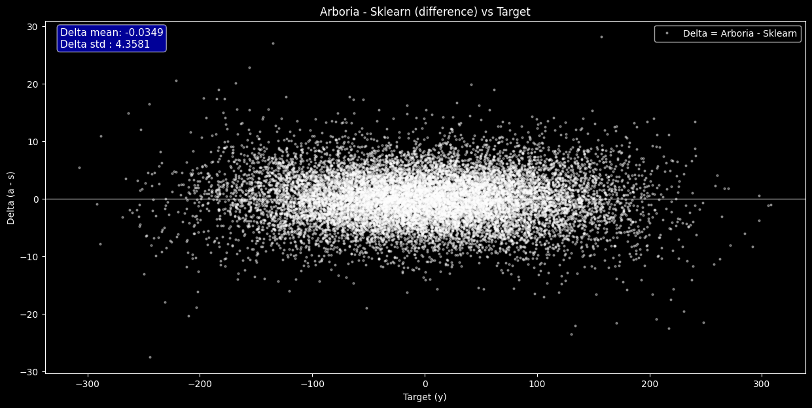

# 🌳 Arboria


### A lightweight machine learning Python/C++ module for tree-based models.

This repository contains C++ implementations of tree-based models with Python bindings.

## Features

This version currently supports :

### `DecisionTree` 
`DecisionTreeClassifier` / `DecisionTreeRegressor`
- `.fit`: trains a decision tree using the CART algorithm
- `.predict`: predicts the labels for input samples
- Hyperparameters currently include :
    - `max_depth` : maximum depth the tree is allowed to reach
    - `min_sample_split` : minimum number of sample required in a node to allow a split


### `RandomForest`
 `RandomForestClassifier` / `RandomForestRegressor`
- `.fit`: fits a RandomForest with `n_estimators` trees. Uses RandomK feature selection (`max_features` features). Supports reproducible randomness via `seed`.
- `.predict` / `.predict_proba` (classification only): predicts class labels or returns the average class probabilities across all trees
- `.out_of_bag`: returns accuracy on training samples not bootstrapped during training
- Hyperparameters currently include :
    - `n_estimators` : number of trees in the forest
    - `max_depth` : maximum depth each tree is allowed to reach
    - `max_features` : number of features randomly selected at each split
    - `max_samples` : fraction of training set to bootstrap for each tree
    - `min_sample_split` : minimum number of sample required in a node to allow a split
    - `n_jobs` : number of threads to launch for training; -1 uses all cores
    - `seed` : random seed 

## Installation

### Requirements
- Python >= 3.9
- A C++ compiler with C++20 support (clang / gcc)
- CMake (installed automatically by `pip` when possible)

````bash
git clone https://github.com/fantinsib/arboria.git
cd arboria
pip install .
````
Recommended tip : install in a venv 
````bash
python -m venv .venv
source .venv/bin/activate
pip install -U pip
pip install .
````

## Usage

A demo notebook is available : **[arboria_demo.ipynb](https://github.com/fantinsib/arboria/blob/main/docs/arboria_demo.ipynb)**

````python
from arboria import DecisionTreeRegressor, RandomForestClassifier, accuracy
````

### Initializing the models

````python
tree = DecisionTreeRegressor(max_depth=5, min_sample_split=10)

rf = RandomForestClassifier(
    n_estimators= 80,
    max_depth= 10, 
    max_features=6,
    max_samples= 0.9,
    min_sample_split=10,
    n_jobs = -1,
    seed=10
)
````

### Fit

````python
tree.fit(x_train, y_train)
rf.fit(x_train, y_train, criterion = "entropy")
````

### Predict

````python
# Returns predicted classes as a np array of int
tree.predict(x_test) 
rf.predict(x_test) 

# Returns an array of the trees voting averages :
rf.predict_proba(x_test)
````

### Evaluate 
````python
# Returns the accuracy score for the predictions :
accuracy(y_pred, y_test)

# Returns accuracy score on the samples not bootstrapped during training :
rf.out_of_bag(x_train, y_train)
````

### Additionnal Documentation 

Additional [notes](docs/notes/) and [diagrams](docs/diagrams/) can be found in the [docs folder](docs/) of this repository.

## Performance Tests

The chosen benchmark is the `sklearn` algorithm for RandomForest. Test details ([history](test_python/perf/perf_logs) and [the testing script](test_python/perf/arboria_perf.py) can be found in test_python/perf folder).

**Note** : the following test were run with parameters :

```python
n_estimators = 50	
max_depth = 8
max_features = "sqrt"
max_samples = 0.9
min_samples_split = 10
n_jobs = -1
```
for sklearn and arboria with 1 warmup and 10 repeats. All datasets are synthetically generated with 30 features, using the `make_classification` function from sklearn. 

### Current performance 

***
**Training**

On intermediate/large datasets (from 25k samples to 250k), `scikit-learn` still outperforms `arboria` for training speed by around **15-25%**. On the largest setting (250k samples), arboria for instance reaches around **84%** of scikit-learn’s training speed for classification and around **77%** of regression speed. The difference seems however to stay relatively stable passed a certain threshold.

On intermediate/small datasets (roughly 2.5k to 10k samples), arboria starts benefitting from the high fixed overhead performance costs of sklearn. It achieves comparable or slightly better performance for  training both in regression and classification.

Finally, on small datasets, arboria outperforms sklearn, reaching up to 6× faster training. This difference is again largely the result of the overhead of sklearn.


***
**Inference**

Arboria has a slight edge for inference across all tested dataset. Although the gap narrows as the number of samples increases, arboria consistently achieves faster prediction and prediction-probability times, with speedups ranging from ~1.2× to ~2.3× on datasets larger than 50k samples. This is again realistically due to the overheads of Sklearn.

***



***

**Detailed results**

- Datasets are composed of 30 features
- Train/test decomposition is 70%/30%
- Percentages are calculated as the time taken by sklearn divided by the time taken by arboria in ms.

*Classification* :

Number of samples|	Fit|	Predict	|Predict Proba|
|-----------|-------|-------|-------|
| 500	    | 6.13x	| 84.32x| 86.79x |
| 1000	    | 3.90x	| 58.70x| 60.96x |
| 2500	    | 1.70x	| 33.83x| 33.31x |
| 5000	    | 1.34x	| 20.71x| 21.44x|
| 10 000	| 1.05x	| 9.35x	| 9.21x |
| 25 000	| 0.97x	| 4.31x	| 4.34x |
| 50 000	| 0.82x	| 2.29x	| 2.34x |
| 100 000	| 0.89x	| 2.37x	| 2.32x |
| 150 000	| 0.82x	| 1.58x	| 1.52x |
| 200 000   | 0.76x | 1.74x | 1.64x |
| 250 000	| 0.84x	| 1.36x	| 1.26x |

***

*Regression* :

Number of samples|Fit|	Predict	
|-----------|-------|-------|
| 500	    | 6.58x	| 82.69x|
| 1000	    | 2.89x	| 56.86x|
| 2500	    | 1.89x	| 33.87x|
| 5000      | 1.23x | 19.66x|
| 10 000	| 1.00x	| 9.25x	| 
| 25 000	| 0.93x	| 4.42x	| 
| 50 000	| 0.86x	| 2.08x	| 
| 100 000	| 0.79x	| 2.22x	| 
| 150 000   | 0.78x | 2.05x |
| 200 000   | 0.79x | 1.64x | 
| 250 000	| 0.77x | 1.46x	| 


***

More detailed results, including about scoring, are available in the [results csv](test_python/perf/bench_results_4_tests_20260130_185031.csv). For classification, accuracy is very close for arboria and sklearn predictions. 

In order to validate the regression logic, RandomForest from arboria and sklearn were trained with the same hyperparameters on the same synthetic dataset (sklearn `make_regression`). The following plots illustrate the results : 



 Plotting the target values against the predictions for Arboria and scikit-learn shows visually that both models achieve a similar level of precision, which is confirmed by comparable RMSE and MAE values.



Plotting the target values against the residuals for both models again highlights the absence of any strong difference in predictive power between Arboria and scikit-learn. It is nevertheless interesting to note the presence of larger positive residuals for low values of $y$ and larger negative residuals for high values of $y$. This illustrates a tendency of both models to overestimate extreme low values and underestimate extreme high values.



This final graph plots the raw difference between Arboria and scikit-learn predictions for each sample. This shows no clear structure or systematic pattern , which suggests that the observed differences are mainly due to noise rather than to a structural bias between the two implementations. 

## Roadmap 
 
⚠️ Work still in progress

#### Planned improvements:
- Additional model parameters (min_samples_leaf, class_weights...)
- Performance optimizations for RandomForest
- Extra-Trees, Honest Trees, Quantile Trees

