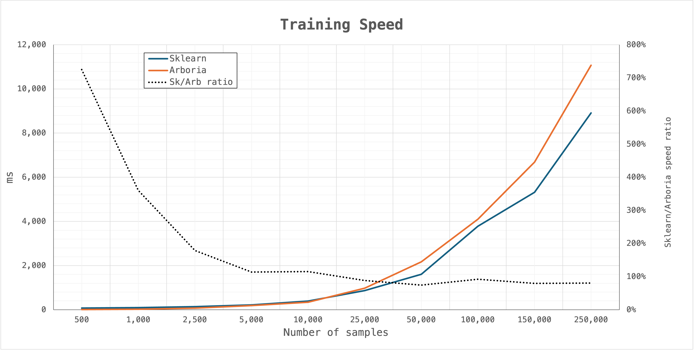
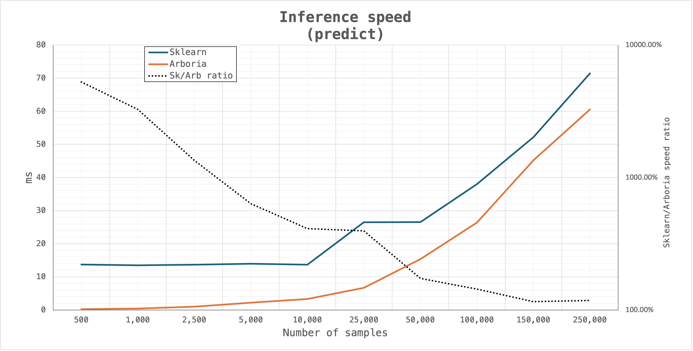

# 🌳 Arboria


### A lightweight machine learning Python/C++ module for tree-based models.

This repository contains C++ implementations of tree-based models with Python bindings.

## Features

This version currently supports :

#### `DecisionTree` (binary classification)
- `.fit`: trains a decision tree using the CART algorithm
- `.predict`: predicts the labels for input samples
- Hyperparameters currently include :
    - `max_depth` : maximum depth the tree is allowed to reach
    - `min_sample_split` : minimum number of sample required in a node to allow a split


#### `RandomForest` (binary classification)
- `.fit`: fits a RandomForest with `n_estimators` trees. Uses RandomK feature selection (`max_features` features). Supports reproducible randomness via `seed`.
- `.predict` / `.predict_proba`: predicts class labels or returns the average class probabilities across all trees
- `.out_of_bag`: returns accuracy on training samples not bootstrapped during training
- Hyperparameters currently include :
    - `n_estimators` : number of trees in the forest
    - `max_depth` : maximum depth each tree is allowed to reach
    - `max_features` : number of features randomly selected at each split
    - `max_samples` : fraction of training set to bootstrap for each tree
    - `min_sample_split` : minimum number of sample required in a node to allow a split
    - `n_jobs` : number of threads to launch for training; -1 uses all cores
    - `seed` : random seed 

## Installation

### Requirements
- Python >= 3.9
- A C++ compiler with C++20 support (clang / gcc)
- CMake (installed automatically by `pip` when possible)

````bash
git clone https://github.com/fantinsib/arboria.git
cd arboria
pip install .
````
Recommended tip : install in a venv 
````bash
python -m venv .venv
source .venv/bin/activate
pip install -U pip
pip install .
````

## Usage

A demo notebook is available : **[arboria_demo.ipynb](https://github.com/fantinsib/arboria/blob/main/docs/arboria_demo.ipynb)**

````python
from arboria import DecisionTree, RandomForest, accuracy
````

### Initializing the models

````python
tree = DecisionTree(max_depth=5, min_sample_split=10)

rf = RandomForest(
    n_estimators= 80,
    max_depth= 10, 
    max_features=6,
    max_samples= 0.9,
    min_sample_split=10,
    n_jobs = -1,
    seed=10
)
````

### Fit

````python
tree.fit(x_train, y_train, criterion="gini")
rf.fit(x_train, y_train, criterion = "entropy")
````

### Predict

````python
# Returns predicted classes as a np array of int
tree.predict(x_test) 
rf.predict(x_test) 

# Returns an array of the trees voting averages :
rf.predict_proba(x_test)
````

### Evaluate 
````python
# Returns the accuracy score for the predictions :
accuracy(y_pred, y_test)

# Returns accuracy score on the samples not bootstrapped during training :
rf.out_of_bag(x_train, y_train)
````

### Additionnal Documentation 

Additional [notes](docs/notes/) and [diagrams](docs/diagrams/) can be found in the [docs folder](docs/) of this repository.

## Performance Tests

The chosen benchmark is the `sklearn` algorithm for RandomForest. Test details ([history](test_python/perf/perf_logs) and [the testing script](test_python/perf/arboria_perf.py) can be found in test_python/perf folder).

**Note** : the following test were ran with parameters :

```python
n_estimators = 100	
max_depth = 8
max_features = "sqrt"
max_samples = 0.9
min_samples_split = 10
n_jobs = -1
```
for sklearn and arboria with 1 warmup and 10 repeats. All datasets are synthetically generated with 30 features, using the `make_classification` function from sklearn. 

### Current performance 

***
**Training**

On intermediate/large datasets (from 25k samples to 250k), `scikit-learn` still outperforms `arboria` for training speed by around **15-25%**. On the largest setting (250k samples), arboria for instance reaches around **83%** of scikit-learn’s training speed.

On intermediate/small datasets (roughly 2.5k to 10k samples), arboria starts benefitting from the high fixed overhead performance costs of sklearn. It achieves comparable or slightly better performance for  training, from around *15% to 80%* faster speed depending on dataset size.

Finally, on small datasets, arboria outperforms sklearn, reaching up to 7–8× faster training. This difference is again largely the result of the overhead of sklearn.



***
**Inference**

Arboria has a slight edge for inference across all tested dataset. Although the gap narrows as the number of samples increases, arboria consistently achieves faster prediction and prediction-probability times, with speedups ranging from ~1.1× to ~1.7× on datasets larger than 50k samples. This is again realistically due to the overheads of Sklearn.

***


***

**Detailed results**

- Datasets are composed of 30 features
- Train/test decomposition is 70%/30%
- Percentages are calculated as the time taken by sklearn divided by the time taken by arboria in ms.

Number of samples|	Fit|	Predict	|Predict Proba|
|-----------|-------|-------|-------|
| 500	    | 725%	| 5255%	| 5567% |
| 1000	    | 360%	| 3268%	| 3406% |
| 2500	    | 179%	| 1345%	| 1421% |
| 5000	    | 114%	| 633%	| 654%  |
| 10 000	| 115%	| 411%	| 413%  |
| 25 000	| 88%	| 396%	| 397%  |
| 50 000	| 74%	| 173%	| 177%  |
| 100 000	| 92%	| 144%	| 146%  |
| 150 000	| 80%	| 115%	| 112%  |
| 250 000	| 80%	| 118%	| 109%  |


## Roadmap 
 
⚠️ Work still in progress

#### Planned improvements:
- Additional model parameters (min_samples_leaf, class_weights...)
- Performance optimizations for RandomForest
- Extra-Trees, Honest Trees, Quantile Trees

